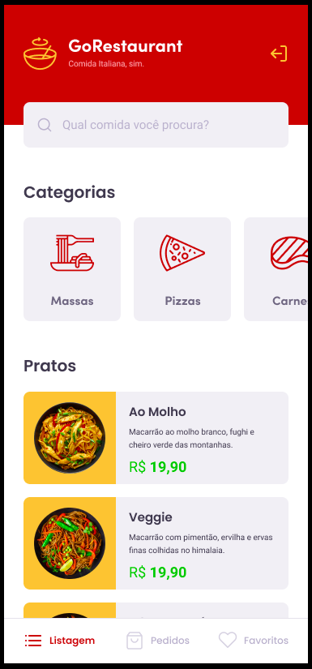

# GoRestaurante-Mobile
Esse é um desafio do Bootcamp GoStack da Rocketseat. Para praticar React Native junto com TypeScript para criar um pequeno app para pedidos de comida.<br/>
 Mais informaçes sobre o desafio acesse [aqui](https://github.com/rocketseat-education/bootcamp-gostack-desafios/tree/master/desafio-react-native-delivery)
 
# Layout
<p align="center">
  
  
  
  
  
  
</p>


# Tecnologias 
React Native ⚛️ <br />
Typescript 🦕 </br>
Styled-Components 💅🏻 <br />
Jest 🃏 <br />


# Como obter esse repositório? 
Para obter esse projeto, siga os passos:
1. Clone esse repositório utilizando <code>git clone</code>.
2. Rode o comando <code> yarn </code> na raíz da pasta do projeto clonado para baixar as dependências.
3. Rode <code>json-server server.json -p 3333</code> na raíz da pasta do projeto para inicializar a Fake API.
4. Rode o comando <code> yarn android</code> (se estiver emulando em um android) ou <code>yarn ios</code> 
(se estiver emulando em um ios) na raíz da pasta do projeto clonado para instalar o app no emulador.
5. Rode <code> yarn start </code> na raíz da pasta do projeto para inicializar o Metro Bundler.

⚠️ Caso o projeto não mostre os produtos rode <code>adb reverse tcp:3333 tcp:3333</code> antes de iniciar a Fake API ⚠️

# Como Contribuir? 
**Faça um fork deste repositório**

```bash
# Clone o seu fork
$ git clone url-do-seu-fork && cd GoRestaurantMobile

# Crie uma branch com sua feature ou correção de bugs
$ git checkout -b minha-branch

# Faça o commit das suas alterações
$ git commit -m 'minhas alterações'

# Faça o push para a sua branch
$ git push origin minha-branch
```

Delete sua branch, se quiser, quando o merge da sua pull request for feito. <br />

Autor: <a href="https://www.linkedin.com/in/adelar-de-mello-1948a1168/" target="blank">Adelar</a>.

[typescript]: https://www.typescriptlang.org/
[reactjs]: https://reactjs.org
[rn]: https://facebook.github.io/react-native/
